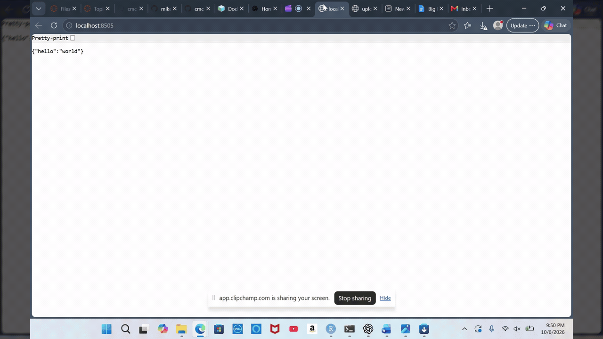

# Flask on Docker

[](https://github.com/rgordon05/flask-on-docker/actions/workflows/dev-build.yml)

## Overview

I built this project by following the TestDriven.io Flask and Docker tutorial. It runs a Flask app with a PostgreSQL database and lets you upload and view images. There are two ways to run it: development uses Flask's server, and production uses Gunicorn and Nginx. The project helped me learn how to connect multiple Docker containers and keep database data and uploaded files between container restarts.

## Demo

This shows the homepage, uploading an image, and opening the uploaded image.



## Running the development version

You need Git, Docker, and Docker Compose v2. Port 8505 needs to be available.

```bash
git clone https://github.com/rgordon05/flask-on-docker.git
cd flask-on-docker
docker compose -f docker-compose.yml up -d --build
```

Open http://localhost:8505/ to see the homepage.

To upload an image, go to http://localhost:8505/upload, choose a file, and click Upload. The form clears after uploading. Open `http://localhost:8505/media/FILENAME` to view it, replacing `FILENAME` with the exact filename, including its extension.

You can also check the example static file at http://localhost:8505/static/hello.txt.

To see logs or stop the app:

```bash
docker compose -f docker-compose.yml logs --tail=50 web
docker compose -f docker-compose.yml down
```

The development startup script resets the database tables each time it starts. The passwords in `.env.dev` are only for development.

## Running the production version

Stop the development version first because both versions use port 8505.

For a new setup, create `.env.prod` and `.env.prod.db` in the main project folder. Use the same new, strong password in both files. A randomly generated hexadecimal password works in the database URL without special-character encoding.

Contents of `.env.prod`:

```dotenv
FLASK_APP=project/__init__.py
FLASK_DEBUG=0
DATABASE_URL=postgresql+psycopg2://hello_flask:PRIVATE_PASSWORD@db:5432/hello_flask_prod
SQL_HOST=db
SQL_PORT=5432
DATABASE=postgres
APP_FOLDER=/home/app/web
```

Contents of `.env.prod.db`:

```dotenv
POSTGRES_USER=hello_flask
POSTGRES_PASSWORD=PRIVATE_PASSWORD
POSTGRES_DB=hello_flask_prod
```

Replace `PRIVATE_PASSWORD` with your password. Both files are in `.gitignore` and should never be uploaded to GitHub.

Start the services:

```bash
chmod 600 .env.prod .env.prod.db
docker compose -f docker-compose.prod.yml up -d --build
```

After startup, initialize a new database with:

```bash
docker compose -f docker-compose.prod.yml exec web python manage.py create_db
```

**This command deletes existing tables, so only use it for a new database or an intentional reset.**

The website uses the same URLs as the development version. Keep uploaded images below 1 MB.

To stop it:

```bash
docker compose -f docker-compose.prod.yml down
```

The production database and uploads stay in Docker volumes. Don't add `-v` unless you want to delete them.

## Using a remote server

If you're running Docker on a server, use an SSH tunnel from your own computer:

```bash
ssh -L 8505:127.0.0.1:8505 USER@SERVER -p SSH_PORT
```

Replace `USER`, `SERVER`, and `SSH_PORT` with your connection details. Leave the terminal connected and open http://localhost:8505/ in your browser.

## GitHub Actions

The workflow builds and starts the development version whenever code is pushed or a pull request is opened. It checks that the homepage returns `{"hello":"world"}`. The badge at the top shows the build status.

## Tutorial

[Tutorial: Dockerizing Flask with Postgres, Gunicorn, and Nginx](https://testdriven.io/blog/dockerizing-flask-with-postgres-gunicorn-and-nginx/)

I used port 8505, selected the psycopg2 database driver explicitly, and changed the Debian package sources to archived repositories so the tutorial's `slim-buster` image would build. I also added a check for uploading without selecting a filename.

This is a class project using the tutorial's older dependencies. It does not include HTTPS or login protection for a public deployment.
